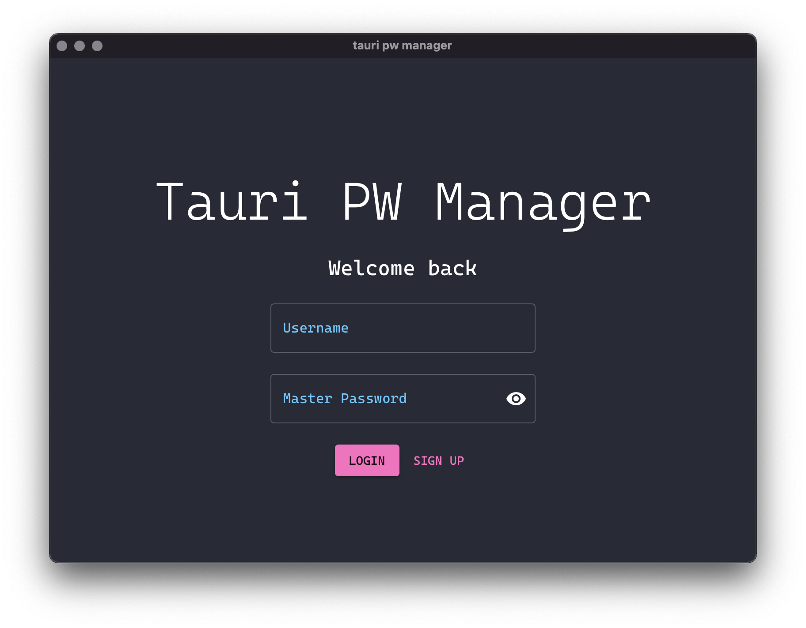

# tauri-pw-manager (working title)
A desktop password manager using Tauri, with a backend in Rust and a frontend in Typescript and React.

:warning: A work in progress



## setup
Assumes you have the [Rust toolchain](https://rustup.rs/) and [npm](https://www.npmjs.com/) installed. Run the following to install dependencies:

```bash
npm run setup
```

## usage
```bash
cargo tauri dev    # to build and run the app in development
cargo tauri build  # to build a release version of the app
```
