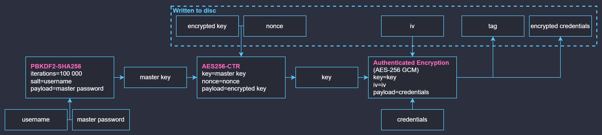

# tauri-pw-manager (working title)
A desktop password manager using Tauri, with a backend in Rust and a frontend in Typescript and React.

:warning: A work in progress


## Cryptography architecture


## usage
Assumes you have the [Rust toolchain](https://rustup.rs/) and [npm](https://www.npmjs.com/) installed.

```bash
npm run setup      # install dependencies
cargo tauri dev    # run the app in development mode
cargo tauri build  # build a release version of the app
```
